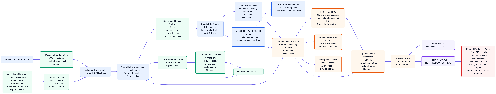

# Ito: Multi-Branch Trading-System Foundation

> *"A safe trading system is not defined by how quickly it can send an order, but by how deliberately it refuses to send one when its evidence is incomplete."*

[](https://github.com/ak495867/Ito/actions/workflows/ci.yml )
[](https://github.com/ak495867/Ito/blob/main/LICENSE.md )
[](https://github.com/ak495867/Ito#production-readiness-what-remains )
[](https://github.com/ak495867/Ito#deployment-boundaries )
[](https://isocpp.org/ )
[](https://www.rust-lang.org/ )
[](https://www.python.org/ )


## The Concept

Ever wanted to explore a multi-branch trading-system architecture without turning every control into an implicit assumption? **Ito** is a local-first engineering foundation for deterministic trading simulation, policy validation, controlled connectivity, hardware-oriented risk gating, replay, reconciliation, and operational-readiness testing.

Ito separates latency-sensitive execution paths from risk policy, connectivity authorization, session leases, routing, persistence, observability, replay, configuration validation, and FPGA-oriented controls. The repository combines C++, Rust, OCaml, Python, and SystemVerilog so that the same operational boundaries can be exercised across software, policy, security, and hardware models.

Ito is designed for engineering development, deterministic simulation, controlled laboratory integration, paper or shadow testing, policy validation, hardware simulation, regression analysis, and operational design. It is **not** a venue-certified gateway, a production exchange connection, or a substitute for a regulated trading platform.

---

## Core Philosophy

| Feature | Description |
| --- | --- |
| **Layered Architecture** | C++ handles execution, risk, journaling, connectivity, routing, reconciliation, leases, and observability; Rust handles security-sensitive validation and release utilities; OCaml validates policies and dynamic circuit-breaker behavior; Python supports operations, replay, recovery, portfolio analysis, and evidence generation; SystemVerilog models hardware-side gating and sequencing. |
| **Fail-Closed Operation** | Missing or invalid mode, scope, authorization, lease, mTLS, sequence, expiry, digest, recovery, portfolio, or policy inputs block the relevant action instead of silently allowing it. |
| **Deterministic Validation** | Identical source, configuration, fixtures, and toolchain inputs produce repeatable build, test, frame, release-binding, backup, snapshot, and evidence results. |
| **Live-Disabled Defaults** | Exchange and broker profiles remain live-disabled. Runtime mode is explicit and restricted. The repository does not request or embed production credentials. |
| **Cross-Language Contracts** | Versioned JSON schemas and generated register-map artifacts keep the C++, Rust, Python, and SystemVerilog boundaries aligned. |
| **Hardware-Aware Risk** | Software policy decisions are mapped to generated risk-frame offsets and exercised through pre-trade gate, accelerator, protocol bridge, venue multiplexer, rate limiter, and testbench paths. |
| **Durable Local Evidence** | Journal persistence, transactional local event storage, snapshots, manifest-verified backups, recovery comparisons, release digests, SBOM/provenance, health metrics, and simulation reports are generated as inspectable artifacts. |
| **Explicit Production Boundary** | Local simulations can demonstrate failure-shaped behavior, but they do not manufacture venue certification, HSM/KMS custody, target-FPGA evidence, production paging, or organizational approval. |
| **No Source Comments** | The current source policy intentionally requires production source files to contain no comments. Design rationale, specifications, operating procedures, and evidence are stored in documentation and metadata. |

---



## Architecture at a Glance

| Layer | Main responsibilities | Representative paths |
| --- | --- | --- |
| **Execution and Risk** | Order lifecycle, quantity-aware fills, policy limits, signed positions, gross exposure, expiry, halt handling, and checked fill accounting | `cpp/ito_execution`, `cpp/ito_risk`, `cpp/ito_session` |
| **Connectivity** | Simulator identity mapping, controlled network adapter behavior, TLS/mTLS configuration, venue registry, session readiness, pending correlations, and uncertain-result handling | `cpp/ito_connectivity`, `cpp/ito_session` |
| **Routing and Reconciliation** | Price-deviation controls, route authorization, lease validity, safe fallback, execution reconciliation, and failover fencing | `cpp/ito_routing`, `cpp/ito_reconciliation` |
| **Security and Release** | Bounded authenticated wire frames, scope and lease validation, release digest binding, artifact verification, key-rotation drills, and deterministic provenance | `rust/connectivity_guard`, `rust/policy_signer`, `rust/artifact_verifier`, `scripts/operations` |
| **Policy and Circuit Breakers** | Risk-policy structure, expiration, side-aware limits, overflow-safe checks, policy replacement, manual clear, and dynamic breaker stress | `ocaml/risk_policy`, `ocaml/policy_engine`, `ocaml/circuit_breaker` |
| **Hardware Controls** | Pre-trade gating, risk acceleration, register-map encoding, order sequencing, backpressure, venue selection, protocol bridging, rate limiting, and latency telemetry | `rtl/risk_gate`, `rtl/order_sequencer`, `rtl/protocol_bridge`, `rtl/venue_adapters`, `rtl/telemetry` |
| **Operations and Evidence** | Recovery archives, durable SQLite events and snapshots, health reports, Prometheus-compatible metrics, portfolio exposure, SBOMs, simulation evidence, and readiness classification | `python/operations`, `python/portfolio`, `scripts/operations`, `docs/production` |

---

## Repository Layout

| Directory | Purpose |
| --- | --- |
| `apps` | Executable entry points for execution, risk, gateway, operations, exchange simulation, and venue routing |
| `cpp` | Native execution, risk, journaling, exchange, connectivity, routing, session, reconciliation, and metrics libraries |
| `rust` | Connectivity guard, risk service, policy signer, artifact verifier, and security-agent workspace |
| `ocaml` | Policy validation and dynamic circuit-breaker engines |
| `python` | Backtest, replay, operations, connectivity, reconciliation, portfolio, health, and durable-store utilities |
| `rtl` | SystemVerilog risk gates, accelerators, bridges, multiplexers, sequencers, rate limiters, and telemetry |
| `interfaces` | Versioned schemas and generated hardware register-map artifacts |
| `config` | Risk, routing, broker, exchange, and deployment profiles; live operation remains disabled by default |
| `infra` | Container, Compose, systemd, and Prometheus configuration |
| `scripts` | Build, generation, deployment, benchmarking, recovery, release, evidence, and validation commands |
| `tests` | C++, Python, Rust, OCaml, failover, connectivity, and RTL-oriented regression coverage |
| `docs` | Architecture, production readiness, hardware pipeline, benchmark, verification, and operational documentation |

---

## Risk and Execution Controls

Ito treats an order as a controlled state transition rather than a single network call. The native risk engine validates policy version, expiration, timestamps, positive prices, order identity, quantity limits, notional limits, signed net positions, gross positions, market-data health, clock health, and halt state. Its fill-accounting path performs checked position updates instead of relying on event counts.

The execution state machine accounts for filled and remaining quantities. It rejects duplicate or zero correlations, preserves journal-assigned event identifiers, stops unsafe fallback after uncertain venue outcomes, and restores readiness only after an explicit halt-clear action.

The Python portfolio foundation complements the native path with weighted-average cost, realized and unrealized P&L, net and gross exposure, gross notional, concentration, loss, limit-breach reporting, deterministic snapshots, and explicit short-sale permission. Short exposure is disabled unless a limit profile explicitly enables it.

| Control | Ito behavior |
| --- | --- |
| **Policy validity** | Invalid, expired, malformed, or non-monotonic policy snapshots fail closed. |
| **Order identity** | Zero or duplicate correlations are rejected; simulator cancellation uses an explicit client-to-venue mapping. |
| **Position limits** | Net and gross positions are checked with signed, overflow-safe arithmetic. |
| **Notional limits** | Positive prices and bounded order notionals are required before approval. |
| **Short sales** | Disabled by default in the portfolio layer and permitted only through explicit policy. |
| **Order lifecycle** | Partial fills, remaining quantity, terminal states, uncertainty, cancel, replace, and recovery semantics are represented explicitly. |
| **Kill switch** | The RTL kill switch remains latched until an explicit clear request is presented. |
| **Downstream backpressure** | The RTL order sequencer retains a transaction until downstream acceptance rather than dropping it. |

---

## Connectivity and Venue Simulation

Ito includes simulator and controlled-network boundaries, but it does not claim production venue connectivity. The simulator adapter maintains client-to-venue order identity so cancel operations use the identifier expected by the simulated venue. The network adapter remains explicitly uncertain until an acknowledgment or terminal venue report arrives.

The controlled connectivity path requires explicit live enablement, TLS, client certificate and key material, peer verification, configured scope, lease ownership, and session readiness. Routes additionally require authorized and lease-valid candidates, valid venue and broker identity, and safe price bounds.

The realistic local venue simulation exercises:

| Scenario | Simulated behavior |
| --- | --- |
| **New order** | Produces a sequenced acknowledgment and records order state. |
| **Cancel** | Produces a cancel acknowledgment only for an accepted order. |
| **Duplicate order** | Returns a duplicate rejection rather than creating a second order. |
| **Reconnect** | Resets session state through a controlled reconnect and verifies the next heartbeat sequence. |
| **Sequence gap** | Rejects a message delivered with an unexpected sequence number. |
| **Shadow flow** | Rejects live-mode activation, permits a synthetic non-live order, and validates a drop-copy message. |

A real deployment still requires native protocol implementation and certification for every venue, real credentials and entitlements, exchange-specific throttles, reject and bust/correct semantics, drop-copy reconciliation, reconnect testing, and venue approval.

---

## Hardware-Oriented Risk Pipeline

The generated register-map version 2 defines non-overlapping field offsets for the risk frame. `scripts/generate_risk_interface.py` validates register bounds and overlaps, then emits synchronized Rust constants, SystemVerilog package constants, and JSON layout metadata.

The hardware-side path includes a transactional pre-trade gate, a pipelined risk accelerator, an order sequencer with downstream-ready backpressure, a protocol bridge, a venue multiplexer, a latched kill switch, and a rate limiter. The Rust risk service can emit an FPGA frame from a validated request, and the full pipeline compares the resulting response against the expected contract.

```bash
python3 scripts/generate_risk_interface.py

cargo run --quiet \
  --manifest-path rust/risk_service/Cargo.toml \
  -- --emit-frame < tests/hardware/risk_request.json

iverilog -g2012 -o build/rtl/ito_tb \
  rtl/common/ito_types.sv \
  rtl/risk_gate/pre_trade_gate.sv \
  rtl/tb/pre_trade_gate_tb.sv

vvp build/rtl/ito_tb
```

Simulation is necessary but not sufficient for an FPGA release. Production hardware evidence still requires vendor synthesis, place-and-route timing margins, clock-domain-crossing analysis, formal verification, reset and fault testing, signed bitstreams, target-board bring-up, and hardware-in-the-loop comparison.

---

## Persistence, Recovery, and Operational Evidence

The native journal loads its last persisted sequence on restart, rejects invalid continuity, and safely escapes JSONL payload content. The Python durable event store uses SQLite WAL mode and full synchronization, rejects duplicate event identity, stores integrity-hashed snapshots, and verifies sequence continuity and snapshot checksums on recovery.

The manifest-verified recovery utility creates an archive containing selected configuration files and a manifest of paths, sizes, and SHA-256 values. Restore rejects unsafe paths and symlinks and writes into a controlled destination. The build compares restored files with their source counterparts.

```bash
python3 scripts/operations/backup_restore.py backup \
  --root . \
  --output build/recovery/ito-config.tar.gz \
  --path config/risk/default_risk_policy.json \
  --path interfaces/register_maps/risk_gate.json \
  --path infra/docker/branch-nodes.json

python3 scripts/operations/backup_restore.py restore \
  --archive build/recovery/ito-config.tar.gz \
  --destination build/recovery/restored

python3 scripts/operations/inspect_evidence.py \
  --root . \
  --output build/evidence/inspection.json
```

The local recovery drill is evidence of archive and restore behavior. It is not proof of replicated durable storage, off-site backup, measured RPO/RTO, split-brain prevention, or a completed disaster-recovery program.

---

## Portfolio Snapshot and Metrics

Generate a deterministic exposure and P&L snapshot from the supplied fixture:

```bash
PYTHONPATH=python/portfolio \
  python3 scripts/operations/portfolio_snapshot.py \
  tests/portfolio/portfolio_case.json \
  --output build/portfolio/snapshot.json
```

Generate Prometheus-compatible evidence from health and portfolio snapshots:

```bash
PYTHONPATH=python/operations \
  python3 python/operations/prometheus_exporter.py \
  --health build/readiness/health.json \
  --portfolio build/portfolio/snapshot.json \
  --output build/readiness/portfolio.prom
```

The exporter reports local validation state, production-readiness state, external blocker count, recovery-artifact presence, net and gross position, gross notional, realized and unrealized P&L, and loss metrics. It is a read-only local exporter; production observability still requires deployed scrape endpoints, dashboards, alert routing, paging, incident ownership, and operational drills.

---

## Release Integrity and SBOM

The release workflow binds the configured risk policy, generated RTL frame, and order schema to three SHA-256 digests. The verifier recomputes each digest and rejects malformed or mismatched values.

```bash
mkdir -p build/release
cargo run --quiet \
  --manifest-path rust/Cargo.toml \
  -p ito-policy-signer -- \
  config/risk/default_risk_policy.json \
  rtl/common/generated/risk_frame_pkg.sv \
  interfaces/schemas/order_intent.schema.json \
  > build/release/binding.json

python3 scripts/operations/verify_release_binding.py \
  --binding build/release/binding.json \
  --policy config/risk/default_risk_policy.json \
  --rtl rtl/common/generated/risk_frame_pkg.sv \
  --schema interfaces/schemas/order_intent.schema.json

python3 scripts/operations/generate_sbom.py \
  --root . \
  --output build/release/sbom.json
```

The SBOM records Rust dependencies, registry checksums where supplied, system build dependencies, and a deterministic source hash. It is a dependency and provenance inventory, not a vulnerability scan, license approval, signed attestation, or replacement for supply-chain review. Digest binding proves content consistency; it does not prove signer authenticity without a real trust root and hardware-backed key custody.

---

## Realistic External-Gate Simulations

The six remaining external production gates have local failure-shaped simulations in `scripts/operations/production_gate_simulations.py`. Run them directly or through the full build:

```bash
python3 scripts/operations/production_gate_simulations.py \
  --root . \
  --output build/readiness/production_gate_simulations.json
```

The simulation report records detailed checks for:

| Gate | Local checks |
| --- | --- |
| **HSM/KMS custody** | Non-exportability, dual operators, key-version advancement, previous-key revocation, signature round-trip, and audit invariants. |
| **Venue protocol** | New-order acknowledgment, cancel acknowledgment, duplicate rejection, reconnect heartbeat, and sequence-gap rejection. |
| **Live session safety** | Explicit live-mode rejection, non-live shadow order, and drop-copy handling. |
| **FPGA evidence** | Generated interface contract, modeled timing slack, reset/CDC assumptions, and backpressure contract. |
| **Incident response** | Alert deduplication, paging intent, acknowledgment, runbook linkage, ordered lifecycle, and resolution. |
| **Governance** | Distinct risk and operations identities, required roles, approval hash, and release-binding association. |

All six simulations can pass while the production gates remain unresolved. A simulation is evidence that the local model behaves as designed; it is not venue certification, HSM/KMS evidence, physical hardware evidence, incident-platform evidence, or organizational approval.

---

## Full Build and Verification

The unified build is the preferred local verification path:

```bash
bash scripts/build_all.sh
```

The pipeline performs the following sequence:

1. Enforces the no-source-comments policy.

1. Evaluates the machine-readable production-readiness matrix.

1. Runs the six realistic external-gate simulations.

1. Creates and restores a manifest-verified recovery archive.

1. Generates local health and Prometheus evidence.

1. Runs the local key-rotation drill and portfolio snapshot.

1. Generates synchronized risk-interface artifacts.

1. Builds the C++ targets and runs CTest.

1. Runs the Rust workspace tests and connectivity guard.

1. Generates and verifies the policy/RTL/schema release binding.

1. Generates the SBOM and source-provenance record.

1. Emits and checks a hardware risk response.

1. Builds and runs the OCaml policy and circuit-breaker paths.

1. Runs the Python test suite and connectivity configuration lint.

1. Runs deterministic multi-branch benchmarks.

1. Runs all SystemVerilog benches.

The current validated baseline is:

| Check | Result |
| --- | --- |
| Source policy | Passed with `no_source_comments` |
| C++ and CTest | 7 of 7 tests passed |
| Rust | Workspace tests passed; connectivity guard and risk service regression paths included |
| OCaml | Policy validation and dynamic circuit-breaker stress passed |
| Python | 25 tests passed in the latest clean validation |
| RTL | Pre-trade, exchange bridge, rate limiter, connectivity control, and risk accelerator benches passed |
| Recovery | Manifest and restored-file comparisons passed |
| Release binding | All selected SHA-256 values recomputed and matched |
| SBOM | Generated successfully with component checksums and source provenance |
| Readiness | 12 of 18 repository gates implemented; 6 external blockers remain |

The RTL simulator may emit informational Icarus messages about constant selects in `always_*` processes. Those messages do not fail the simulations, but they are not evidence of vendor synthesis, timing closure, CDC proof, formal verification, or hardware-in-the-loop behavior.

---

## Deployment Boundaries

The deployment planner defaults to dry-run behavior:

```bash
python3 scripts/deploy_ito.py --action plan
python3 scripts/deploy_ito.py --action build --execute
python3 scripts/deploy_ito.py --action deploy --node branch-ny-node-01 --execute
```

The container and Compose templates use restricted defaults, read-only filesystems where applicable, dropped capabilities, no-new-privileges settings, temporary filesystem restrictions, external secrets, and explicit environment identity fields. The deployment configuration does not create production credentials, certify a venue, or activate live trading by itself.

Keep `ITO_MODE=restricted` or `ITO_MODE=lab` until every external gate has passed its real acceptance evidence. Never treat a passing local build as permission to deploy unsupervised capital.

---

## Production Readiness: What Remains

Ito remains intentionally classified as **`not_production_ready`**. Six external blockers cannot be truthfully closed by simulation alone:

| Gate | Required real-world evidence |
| --- | --- |
| **HSM/KMS production key custody and rotation** | Hardware-backed non-exportable keys, production IAM, dual-control ceremony, rotation and revocation, recovery, audit integration, and independent security approval |
| **Venue-native protocol certification** | Per-venue conformance, exchange-specific sequencing and rejects, throttles, reconnects, drop-copy, cancel/replace, bust/correct behavior, and venue sign-off |
| **Live credentials and session conformance** | Real entitlements, licensed market data, controlled paper/shadow operation, real acknowledgments and fills, feed-gap behavior, reconciliation, and broker/exchange approval |
| **FPGA synthesis, timing, CDC, formal, and HIL** | Vendor synthesis, place-and-route margins, CDC/formal reports, signed bitstream, board bring-up, HIL comparison, and fault injection |
| **Production observability and incident integration** | Live exporters, dashboards, alert routing, paging, ticketing, on-call ownership, runbooks, SLOs, incident drills, and after-action evidence |
| **Independent risk, compliance, and change approval** | Independent model/risk validation, legal and compliance review, access segregation, surveillance and retention, change approval, and signed live-activation authorization |

The complete readiness matrix is `docs/production/readiness_matrix.json`. The detailed gate simulation report is `SIX_EXTERNAL_GATE_SIMULATION_REPORT.md`. The clean-build and evidence review is `CLEAN_BUILD_AND_EXTERNAL_GATE_REVIEW.md`.

---

## Intended Use

Ito is suitable for deterministic simulation, policy development, replay, backtesting utilities, controlled laboratory integration, RTL simulation, release-integrity checks, local recovery drills, portfolio-risk prototyping, paper or shadow trading, and operational design.

Ito is not a recommendation engine, investment adviser, venue-certified gateway, regulated trading platform, or proof that a strategy will make money. It does not replace independent risk, compliance, legal, security, hardware, operations, accounting, or market-access review.

---

## License and Ownership

No license grant is inferred by this README. Confirm the applicable repository license, third-party dependency terms, data rights, venue agreements, and deployment approvals before distribution or operation.