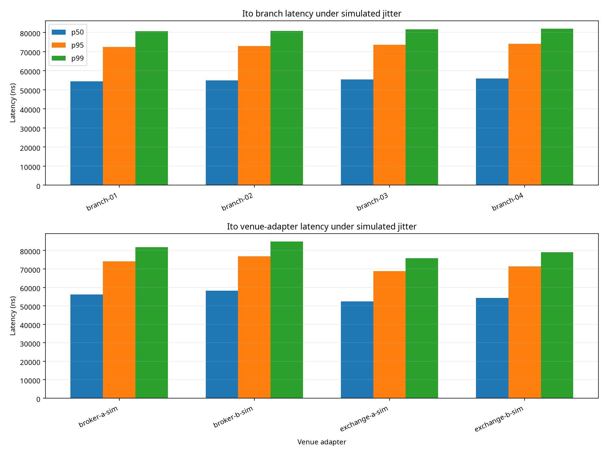

# Ito Multi-Branch Multi-Venue Benchmark Report

The benchmark processed **160000** messages across **4** branches and **4** venue adapters under deterministic simulated network jitter. The exchange simulator status was `exchange_simulator_pass`.

## Aggregate results

| Metric | Value |
| --- | ---: |
| Messages | 160000 |
| Throughput | 999570.3 messages/second |
| p50 | 55132 ns |
| p95 | 73314 ns |
| p99 | 81363 ns |
| Maximum | 140926 ns |

## Venue-adapter p99 profile

| Adapter | Messages | Mean | p50 | p95 | p99 | Maximum |
| --- | ---: | ---: | ---: | ---: | ---: | ---: |
| broker-a-sim | 40000 | 56227.46 ns | 56218 ns | 74066 ns | 81768 ns | 137052 ns |
| broker-b-sim | 40000 | 58266.4 ns | 58181 ns | 76783 ns | 84848 ns | 140926 ns |
| exchange-a-sim | 40000 | 52261.76 ns | 52340 ns | 68767 ns | 75805 ns | 123539 ns |
| exchange-b-sim | 40000 | 54294.93 ns | 54237 ns | 71425 ns | 78982 ns | 128928 ns |

## Branch profile

| Branch | Messages | Mean | p50 | p95 | p99 | Maximum |
| --- | ---: | ---: | ---: | ---: | ---: | ---: |
| branch-01 | 40000 | 54514.18 ns | 54392 ns | 72465 ns | 80735 ns | 129417 ns |
| branch-02 | 40000 | 54980.11 ns | 54916 ns | 72913 ns | 80875 ns | 126176 ns |
| branch-03 | 40000 | 55541.09 ns | 55420 ns | 73630 ns | 81567 ns | 137052 ns |
| branch-04 | 40000 | 56015.18 ns | 55869 ns | 74115 ns | 82032 ns | 140926 ns |

## Interpretation

The benchmark is a deterministic software model of transport jitter and processing delay. It is useful for regression and capacity comparisons, but it is not a substitute for hardware timestamping, venue certification, production network measurements, or hardware-in-the-loop testing.
