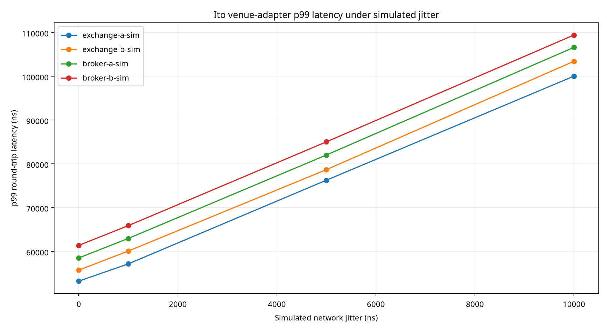

# Ito Multi-Branch P99 Benchmark Suite

The suite evaluated **4** branches, **5000** messages per branch and adapter per scenario, and **4** venue adapters across jitter levels of 0 ns, 1000 ns, 5000 ns, 10000 ns.

## Venue p99 latency by jitter

| Jitter | exchange-a-sim | exchange-b-sim | broker-a-sim | broker-b-sim | Aggregate |
| ---: | ---: | ---: | ---: | ---: | ---: |
| 0 ns | 53178 ns | 55698 ns | 58476 ns | 61347 ns | 60571 ns |
| 1000 ns | 57116 ns | 60051 ns | 62925 ns | 65855 ns | 64138 ns |
| 5000 ns | 76230 ns | 78637 ns | 81985 ns | 84984 ns | 81408 ns |
| 10000 ns | 99990 ns | 103385 ns | 106569 ns | 109387 ns | 105170 ns |

## P99 change from baseline to highest-jitter scenario

| Adapter | Baseline p99 | Highest-jitter p99 | Increase | Increase percent |
| --- | ---: | ---: | ---: | ---: |
| exchange-a-sim | 53178 ns | 99990 ns | 46812 ns | 88.03% |
| exchange-b-sim | 55698 ns | 103385 ns | 47687 ns | 85.62% |
| broker-a-sim | 58476 ns | 106569 ns | 48093 ns | 82.24% |
| broker-b-sim | 61347 ns | 109387 ns | 48040 ns | 78.31% |

## Interpretation

The deterministic model shows monotonic tail-latency growth as jitter increases. The broker-b-sim route has the highest p99 in the tested scenarios, while exchange-a-sim has the lowest. Throughput remains close to one million modeled messages per second because the benchmark uses virtual timestamps rather than sleeping for network delay. These results are regression evidence, not a production-network or venue-certification claim.
